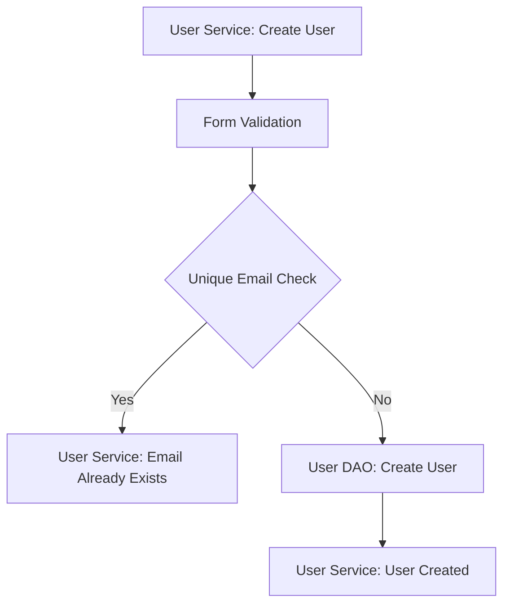
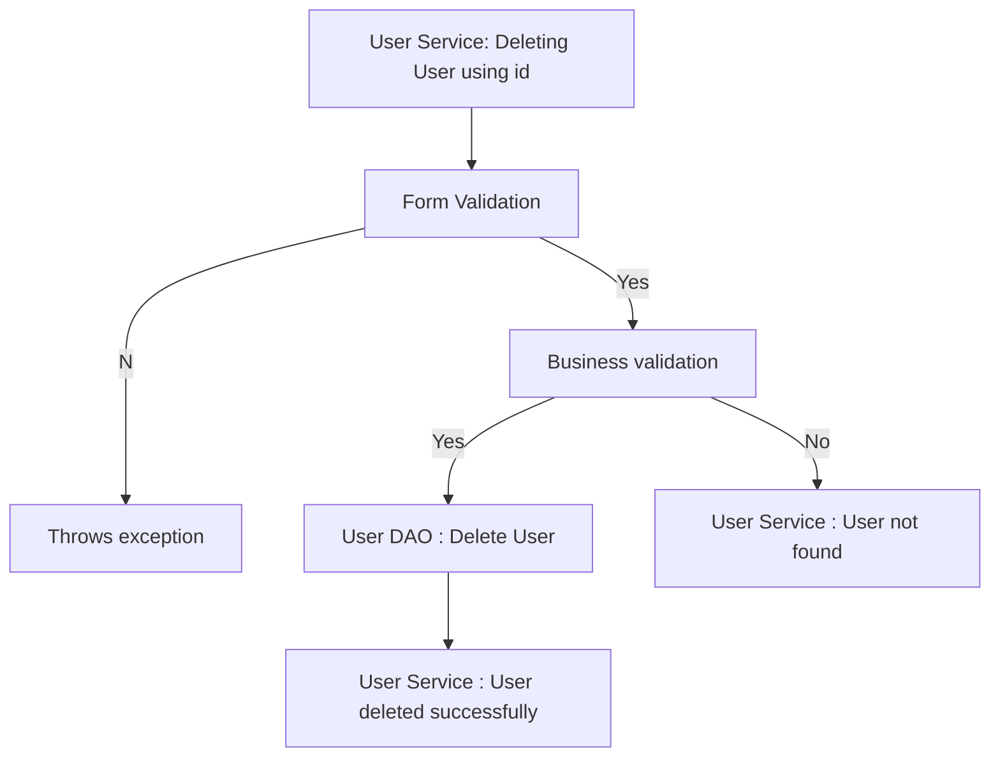
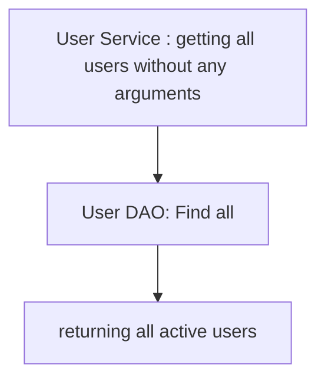
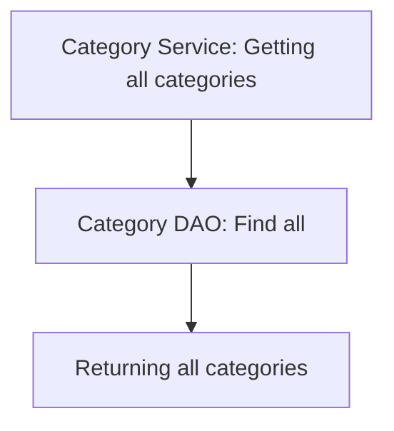
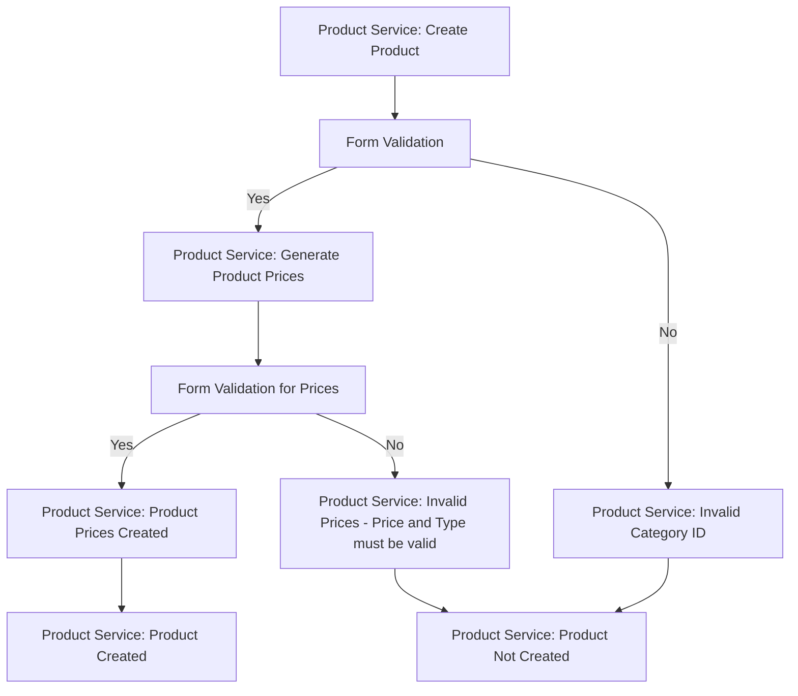
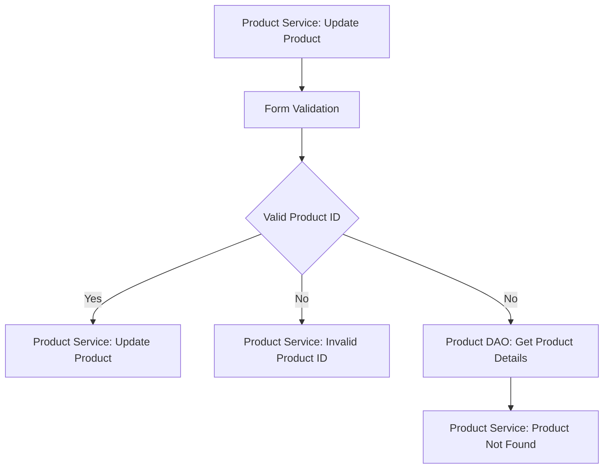
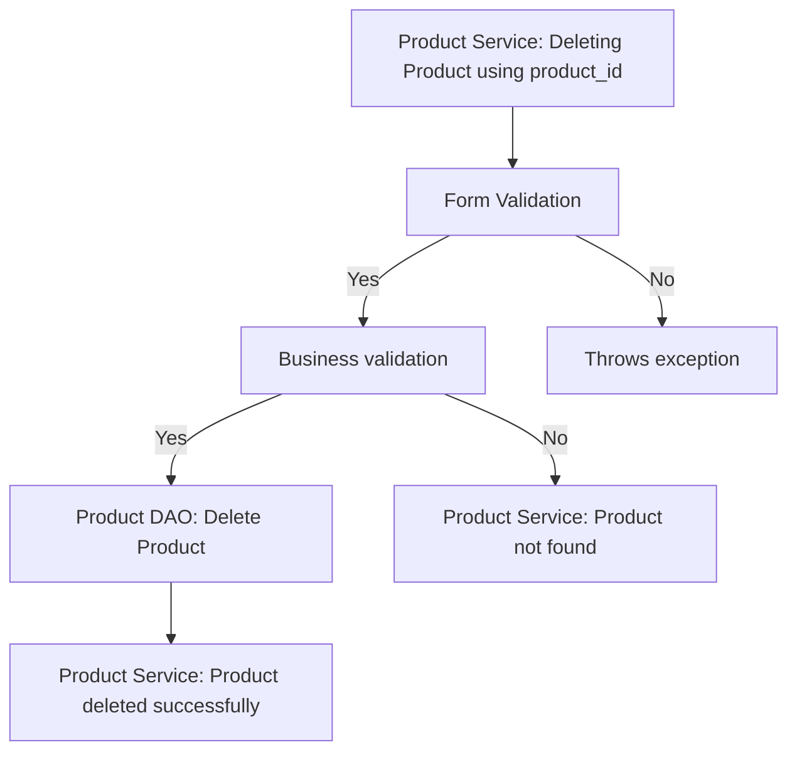
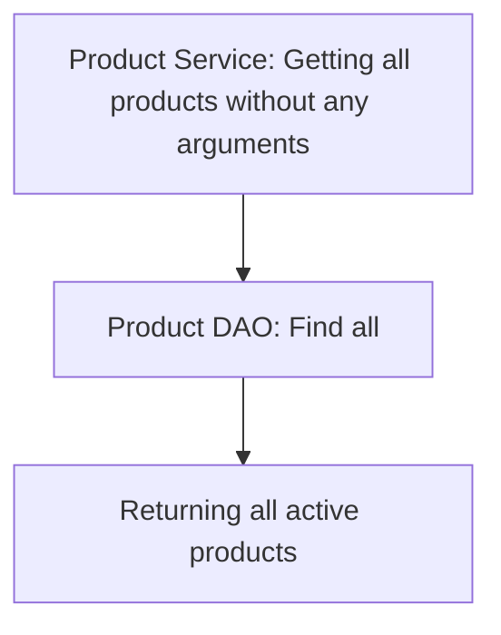
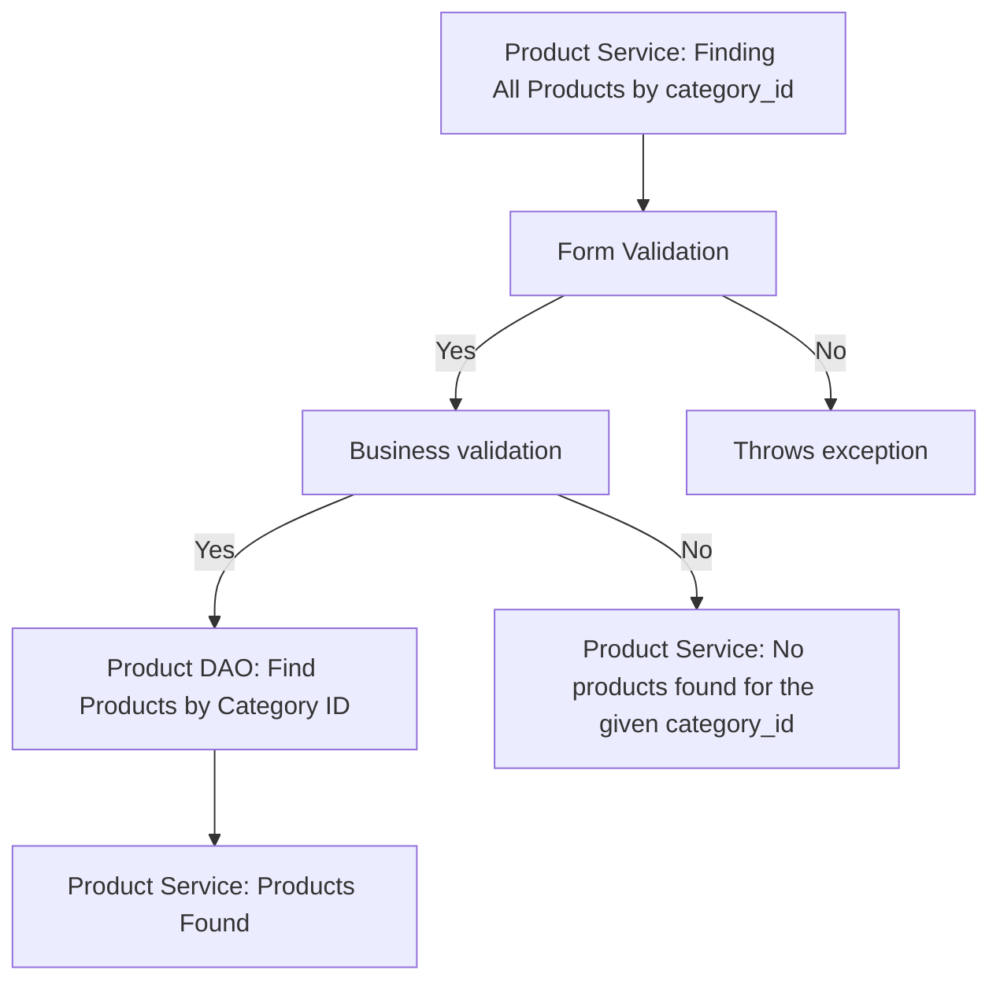

# Todo Application Checklist

## Database Design

- [ ] Create an ER diagram of the database 
- [ ] Write Create table scripts [script](/src/main/resources/db/migration/V1__create_users.sql)

----

## Project Setup

- [ ] Create a new Java project
- [ ] Set up a MySQL database
- [ ] Add necessary libraries
	- [ ] JDBC, 
	- [ ] MySQL Connector, 
	- [ ] JUnit, 
	- [ ] Dotenv

## Module: User

### Feature : Create User
#### Pre-requisites : 
- [ ] Create User table  
- [ ] Implement User model  
- [ ] Implement User DAO (create)

#### Validations:
 - [ ] Form validator
   - first name
   - last name
   - email
   - password
   - mobile number
    - [ ] Buisness validator
	- check whether the email already exists

#### Exceptions:
- [ ] Invalid Email Id  
- [ ] Password doesn't match the required format  
- [ ] first name cannot be null or empty  
- [ ] last name cannot be null or empty  
- [ ] mobile number does not match the required format
- [ ] User already exists (Business validation)

#### Flow: 

### Feature: Update User 

#### User Story:  
- User can update their profile details. 

#### Pre-requisites:  
- [ ] Implement user model  
- [ ] Implement user DAO (update)

#### Validations:  
- [ ] Form validations  
	 - Validating the fields which the user is going to update(i.e. first name , last name , password , mobile number )  
	 
- [ ] Business validations  
	- check whether the id exists.
  
#### Messages:  
- [ ] Password doesn't match the required format  
- [ ] first name cannot be null or empty  
- [ ] last name cannot be null or empty  
- [ ] mobile number does not match the required format  
- [ ] Invalid id  
- [ ] User not found

#### Flow:  

### Feature: Delete User  

#### User Story:  
   - User can delete their account. 
 
#### Pre-requisites:  
- [ ] Implement user model  
- [ ] Implement user DAO(delete)

#### Validations:  
- [ ] Form validations  
	- Check whether the id is valid or not  
	
- [ ] Business validations  
	- Check whether the id exists.
		
#### Messages:  
- [ ]  Invalid id  
- [ ] User not found

#### Flow:  



### Feature: List User  

#### Pre-requisites:  
- [ ] Implement user model  
- [ ] Implement user DAO(findAll)
#### Validations:  
- [ ] No validations
#### Flow:  


## Module: Categories

### Feature: List Categories
#### Pre-requisites:
- [ ] Implement Category DAO (findAll)

#### Validations:
- [ ] No validations

#### Flow:



## Module: Product

### Feature: Create Product

#### Pre-requisites:
- [ ] Complete Module - 0, Category Module
- [ ] Implement Product model
- [ ] Implement Product DAO (create)
- [ ] Implement Product Prices model
- [ ] Implement Product Prices DAO (create)

#### Validations:
- [ ] Form validator
  - product name
  - description
  - category_id
  - start_date
  - price
  - type

#### Exceptions:
- [ ] Product name cannot be null or empty
- [ ] Description cannot be null or empty
- [ ] Category ID cannot be null or empty
- [ ] Invalid start_date (Start date must be a future date)
- [ ] Invalid price (Price must be a positive number)
- [ ] Invalid type (Type must be 'kg' or 'nos')

#### Flow:


### Feature: Update Product

#### Pre-requisites:
- [ ] Implement Product model
- [ ] Implement Product DAO (update)

#### Validations:
- [ ] Form validator
  - Product ID: Ensure that the product_id is provided and not empty.
  - Product Name: Ensure that the product name is provided and not empty.
  - Description: Ensure that the description is provided and not empty.
  - Category ID: Ensure that the category_id is provided and not empty.
  - Type: Ensure that the type is provided and valid (e.g., 'kg' or 'nos').

#### Exceptions:
- [ ] Product ID cannot be null or empty
- [ ] Product name cannot be null or empty
- [ ] Description cannot be null or empty
- [ ] Category ID cannot be null or empty
- [ ] Invalid product type
- [ ] Invalid start_date
- [ ] Product ID does not exist

#### Flow:

### Feature: Delete Product

#### Pre-requisites:
- [ ] Implement Product model
- [ ] Implement Product DAO (delete)

#### Validations:
- [ ] Form validations
  - Check whether the product_id is valid or not

- [ ] Business validations
  - Check whether the product_id exists.

#### Messages:
- [ ] Invalid product_id
- [ ] Product not found

#### Flow:


### Feature: List Products

#### Pre-requisites:
- [ ] Implement Product model
- [ ] Implement Product DAO (findAll)

#### Validations:
- [ ] No validations

#### Flow:



### Feature: Find All Products by Category ID

#### Pre-requisites:
- [ ] Implement Product model
- [ ] Implement Product DAO (findByCategoryId)

#### Validations:
- [ ] Form validations
  - Check whether the category_id is valid or not

- [ ] Business validations
  - Check whether any product exists with the given category_id.

#### Messages:
- [ ] Invalid category_id
- [ ] No products found for the given category_id

#### Flow:


### Feature: Update Product Price

#### Pre-requisites:
- [ ] Implement Product model
- [ ] Implement Product Prices model
- [ ] Implement Product Prices DAO (update)

#### Validations:
- [ ] Ensure Price ID is provided and not empty.
- [ ] Ensure Product ID is provided and not empty.
- [ ] Ensure Quantity is provided and not empty.
- [ ] Ensure Type is provided and valid (e.g., 'kg' or 'nos').
- [ ] Ensure Start Date is provided and not a past date.

#### Exceptions:
- [ ] Price ID cannot be null or empty.
- [ ] Product ID cannot be null or empty.
- [ ] Quantity cannot be null or empty.
- [ ] Invalid Type.
- [ ] Invalid Start Date.
- [ ] Price ID does not exist.

#### Flow:
```mermaid
graph TD;
  A[Product Prices Service: Update Product Price] --> B[Form Validation]
  B -- Yes --> D[Product Prices Service: Update Product Price]
  B -- No --> E[Product Prices Service: Invalid Input]
  ```


